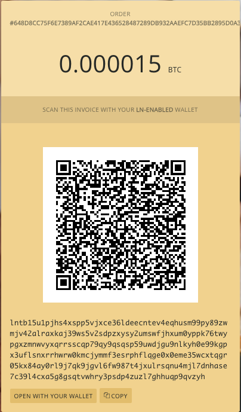

# LIGHTNING NETWORK⚡ THE "HARD" WAY
The following is a reproducible proof of concept to get started with the *Bitcoin Lightning Network*.  
In order to follow this you dont need bitcoins on the main blockchain as we will use the *testnet*.  

> [!WARNING]  
> This is intended as a local lab to learn the basics of lightning node operations, don't follow this to deploy a node in production!  
> Also Keep in mind that the utilized Bitcoins hold no intrinsic value, as they pertain to the test blockchain.  


## Prerequisites
- docker

## Getting started

For this tutorial we will use [LND](https://github.com/lightningnetwork/lnd).  
*LND* is one of the most popular implementations of a lightning node, written in the *Go* programming language.  
pull a specific version of *LND container image* from *dockerhub*:  
```console
docker pull lightninglabs/lnd:v0.17.3-beta
```  

Now run the container in *testnet* mode and with [neutrino](https://github.com/lightninglabs/neutrino) as a backend:  

```console
docker run --name lnd-testnet -v /Users/rago/.lnd/:/root/.lnd  lightninglabs/lnd:v0.17.3-beta --bitcoin.active --bitcoin.testnet --bitcoin.node=neutrino neutrino.addpeer=btcd-testnet.lightning.computer neutrino.feeurl=https://nodes.lightning.computer/fees/v1/btctestnet-fee-estimates.json
```  
> [!NOTE]  
> *Neutrino* is a lightweight client-side technology designed to enhance the privacy and efficiency of wallet applications.  
> Neutrino is an improvement upon traditional SPV, which allows users to verify the inclusion of transactions in the Bitcoin blockchain without downloading the entire blockchain.  

The previous command also maps a local volume path (my user home directory) to the `.lnd` data directory inside our container.  
In this way we ensure persistency of our Lightning node and wallet data even when our container stops.  


Exec inside the running container and launch the command to create a new wallet via `lncli`:  
```console
docker exec -it lnd-testnet lncli create  
```  

Follow the instructions on the screen to generate a new wallet seed.  

Now we need to wait some time as *neutrino* is starting to sync blocks headers for the Bitcoin testnet chain, this may take up to 1 hour with the current blockchain state.  
You can chek che progress by inspecting the container's logs:  
```console
docker logs lnd-testnet -f
```  

Or by checking the size of the `.lnd` folder mounted on our local machine:  
```console
cd  ~/.lnd && watch du -sh *
```  
At the current state of the blockchain (December 2023) the size of the data directory needs to reach almos *700 MB* before synchronization is completed.  


> [!NOTE]  
> All the following lncli commands will specify a macaroon to use in order to authenticate with our node.  
> A [macaroon](https://en.wikipedia.org/wiki/Macaroons_(computer_science))is a type of token used for authentication and authorization.  
> In the realm of distributed systems, macaroons are often used to provide secure access to decentralised APIs or services.  

Export an environment variable with the admin macaroon path inside our node's container:  
```console
export MACAROON_PATH=/root/.lnd/data/chain/bitcoin/testnet/admin.macaroon
```  


Generate a testnet Address via *lncli*:  
```console
docker exec -it lnd-testnet lncli --macaroonpath="$MACAROON_PATH" newaddress p2wkh
```  

Sample output:
```json
{
    "address": "tb1q2usfv065frackdpzn9grar0cag8mdg5wyd7q4h"
}
```  
  

Now we need to obtain some Bitcoin on the testnet.  

Send some testnet bitcoin by leveraging faucet services like [coinfaucet](https://coinfaucet.eu/en/btc-testnet/), by inserting the previously generated address as the payment recipient.  
wait for the stransaction to be validated on the testnet, you can check the progress on [mempool](https://mempool.space/testnet):  
  

<br/>

Now check your lightning wallet balance:  
```console
docker exec -it lnd-testnet lncli --macaroonpath="$MACAROON_PATH" walletbalance
```  
Sample output:  
```json
{
    "total_balance": "1245885",
    "confirmed_balance": "1245885",
    "unconfirmed_balance": "0",
    "locked_balance": "0",
    "reserved_balance_anchor_chan": "0",
    "account_balance": {
        "default": {
            "confirmed_balance": "1245885",
            "unconfirmed_balance": "0"
        }
    }
}
```  


As we can see we now have a total balance of *1245885* satoshis!  
Now we need to open an outbound channel on the testnet, in order to do so choose a node from [1ml](https://1ml.com/testnet/), retrieve it's data and then request channel opening via lncli with these commands:  
```console
lncli connect <peer_pubkey>@<peer_address>
lncli openchannel --node_key=<peer_pubkey> --local_amt=<amount_in_satoshis>
```   


so in our specific case, if we choose [this](https://1ml.com/testnet/node/02312627fdf07fbdd7e5ddb136611bdde9b00d26821d14d94891395452f67af248) node, the commands will be:  
```console
docker exec -it lnd-testnet lncli --macaroonpath="$MACAROON_PATH" connect 02312627fdf07fbdd7e5ddb136611bdde9b00d26821d14d94891395452f67af248@23.237.77.12:9735
```   

and  

```console
docker exec -it lnd-testnet lncli --macaroonpath="$MACAROON_PATH" openchannel --node_key=02312627fdf07fbdd7e5ddb136611bdde9b00d26821d14d94891395452f67af248 --local_amt=50000
```   


Sample output:
```json
{
        "funding_txid": "bfbf2b1096d76e78cb81dc4318d0403ef63efef2b783a4ff8cad85ee39c97a33"
}
```  


Now let's list our channels:  
```console
docker exec -it lnd-testnet lncli --macaroonpath="$MACAROON_PATH" listchannels

{
    "channels": []
}
```  


This may seems strange...we have 0 channels opened.  
In reality this is perfectly normal as our channel funding transaction on the blockchain need to wait 3 block confirmations before it is considered settled.  
Wait some minutes and retry:  
```json
{
    "channels": [
        {
            "active": true,
            "remote_pubkey": "02312627fdf07fbdd7e5ddb136611bdde9b00d26821d14d94891395452f67af248",
            "channel_point": "bfbf2b1096d76e78cb81dc4318d0403ef63efef2b783a4ff8cad85ee39c97a33:0",
            "chan_id": "2795546796528500736",
            "capacity": "50000",
            "local_balance": "46530",
            "remote_balance": "0",
            "commit_fee": "3140",
            "commit_weight": "772",
            "fee_per_kw": "2500",
            "unsettled_balance": "0",
            "total_satoshis_sent": "0",
            "total_satoshis_received": "0",
            "num_updates": "0",
            "pending_htlcs": [],
            "csv_delay": 144,
            "private": false,
            "initiator": true,
            "chan_status_flags": "ChanStatusDefault",
            "local_chan_reserve_sat": "500",
            "remote_chan_reserve_sat": "500",
            "static_remote_key": false,
            "commitment_type": "ANCHORS",
            "lifetime": "40",
            "uptime": "40",
            "close_address": "",
            "push_amount_sat": "0",
            "thaw_height": 0,
            "local_constraints": {
                "csv_delay": 144,
                "chan_reserve_sat": "500",
                "dust_limit_sat": "354",
                "max_pending_amt_msat": "49500000",
                "min_htlc_msat": "1",
                "max_accepted_htlcs": 483
            },
            "remote_constraints": {
                "csv_delay": 144,
                "chan_reserve_sat": "500",
                "dust_limit_sat": "354",
                "max_pending_amt_msat": "49500000",
                "min_htlc_msat": "1",
                "max_accepted_htlcs": 483
            },
            "alias_scids": [],
            "zero_conf": false,
            "zero_conf_confirmed_scid": "0",
            "peer_alias": "1ML.com node ALPHA",
            "peer_scid_alias": "0",
            "memo": ""
        }
    ]
}
```  

Now our outbound channel is open and we have sufficient funds to make some transactions!  
Go to [this](https://starblocks.acinq.co/) e-commerce website, select the product you want, add it to cart and then click "checkout".  
You will be presented with an invoice similar to this:  
  
<br/>

Copy the invoice and pay it via your lightning wallet!  
```console
docker exec -it lnd-testnet lncli --macaroonpath="$MACAROON_PATH" payinvoice lntb15u1pjhs4xspp5vjxce36ldeecntev4eqhusm99py89zwmjv42alraxkaj39ws5v2sdpzxysy2umswfjhxum0yppk76twypgxzmnwvyxqrrsscqp79qy9qsqsp59uwdjgu9nlkyh0e99kgpx3uflsnxrrhwrw0kmcjymmf3esrphflqge0x0eme35wcxtqgr05kx84ay0rl9j7qk9jgvl6fw987t4jxulrsqnu4mjl7dnhase7c39l4cxa5g8gsqtvwhry3psdp4zuzl7ghhuqp9qvzyh
```   

Output Sample:  
```console
Payment hash: 648d8cc75f6e7389af2cae417e436528487289db932aaefc7d35bb2895d0a315
Description: 1 Espresso Coin Panna
Amount (in satoshis): 1500
Fee limit (in satoshis): 75
Destination: 0348cc1a9479697cd52db445ea74149ad40bb01bb2045a3e8acba21b70f94ab7cf
Confirm payment (yes/no): yes

+-------------------------------------+--------------+--------------+--------------+-------+----------+---------------------+-------------------------------------------------------------+
| HTLC_STATE                          | ATTEMPT_TIME | RESOLVE_TIME | RECEIVER_AMT | FEE   | TIMELOCK | CHAN_OUT            | ROUTE                                                       |
+-------------------------------------+--------------+--------------+--------------+-------+----------+---------------------+-------------------------------------------------------------+
| TEMPORARY_CHANNEL_FAILURE @ 1st hop |        0.029 |        0.804 | 1500         | 1.749 |  2542794 | 2795546796528500736 | 1ML.com node ALPHA->24hr Drive Thru->endurance->eclair      |
| TEMPORARY_CHANNEL_FAILURE @ 1st hop |        0.827 |        1.641 | 1500         | 1.764 |  2542834 | 2795546796528500736 | 1ML.com node ALPHA->Towiz_testnet->endurance->eclair        |
| SUCCEEDED                           |        1.665 |        3.258 | 1500         | 1.85  |  2542794 | 2795546796528500736 | 1ML.com node ALPHA->02eb311fca318454d00e->endurance->eclair |
+-------------------------------------+--------------+--------------+--------------+-------+----------+---------------------+-------------------------------------------------------------+
Amount + fee:   1500 + 1.85 sat
Payment hash:   648d8cc75f6e7389af2cae417e436528487289db932aaefc7d35bb2895d0a315
Payment status: SUCCEEDED, preimage: fc510042f72e4dde9ff0566907f52b11473652351b8c591713c8b6bd47e3fc93
```  

We succesfully completed the first payment from our own lightning node!  

The website also confirm the payment:  
  
<br/>

Now list your payment via lncli:  
```console
docker exec -it lnd-testnet lncli --macaroonpath="$MACAROON_PATH" listpayments
```  
Output sample:  
```json
{
    "payments": [
        {
            "payment_hash": "648d8cc75f6e7389af2cae417e436528487289db932aaefc7d35bb2895d0a315",
            "value": "1500",
            "creation_date": "1702385051",
            "fee": "1",
            "payment_preimage": "fc510042f72e4dde9ff0566907f52b11473652351b8c591713c8b6bd47e3fc93",
            "value_sat": "1500",
            "value_msat": "1500000",
            "payment_request": "lntb15u1pjhs4xspp5vjxce36ldeecntev4eqhusm99py89zwmjv42alraxkaj39ws5v2sdpzxysy2umswfjhxum0yppk76twypgxzmnwvyxqrrsscqp79qy9qsqsp59uwdjgu9nlkyh0e99kgpx3uflsnxrrhwrw0kmcjymmf3esrphflqge0x0eme35wcxtqgr05kx84ay0rl9j7qk9jgvl6fw987t4jxulrsqnu4mjl7dnhase7c39l4cxa5g8gsqtvwhry3psdp4zuzl7ghhuqp9qvzyh",
            "status": "SUCCEEDED",
            "fee_sat": "1",
            "fee_msat": "1850",
            "creation_time_ns": "1702385051584619534",
            "htlcs": [
                {
                    "attempt_id": "3",
                    "status": "SUCCEEDED",
                    "route": {
                        "total_time_lock": 2542794,
                        "total_fees": "1",
                        "total_amt": "1501",
                        "hops": [
                            {
                                "chan_id": "2795546796528500736",
                                "chan_capacity": "50000",
                                "amt_to_forward": "1500",
                                "fee": "1",
                                "expiry": 2542754,
                                "amt_to_forward_msat": "1500849",
                                "fee_msat": "1001",
                                "pub_key": "02312627fdf07fbdd7e5ddb136611bdde9b00d26821d14d94891395452f67af248",
                                "tlv_payload": true,
                                "mpp_record": null,
                                "amp_record": null,
                                "custom_records": {},
                                "metadata": ""
                            },
                            {
                                "chan_id": "2479405317705302016",
                                "chan_capacity": "0",
                                "amt_to_forward": "1500",
                                "fee": "0",
                                "expiry": 2542714,
                                "amt_to_forward_msat": "1500748",
                                "fee_msat": "101",
                                "pub_key": "02eb311fca318454d00ed19fee12b5fe3bb6058034a1cb0f1e094d2c075ff93ee7",
                                "tlv_payload": true,
                                "mpp_record": null,
                                "amp_record": null,
                                "custom_records": {},
                                "metadata": ""
                            },
                            {
                                "chan_id": "2467607557938741248",
                                "chan_capacity": "0",
                                "amt_to_forward": "1500",
                                "fee": "0",
                                "expiry": 2542570,
                                "amt_to_forward_msat": "1500000",
                                "fee_msat": "748",
                                "pub_key": "03933884aaf1d6b108397e5efe5c86bcf2d8ca8d2f700eda99db9214fc2712b134",
                                "tlv_payload": true,
                                "mpp_record": null,
                                "amp_record": null,
                                "custom_records": {},
                                "metadata": ""
                            },
                            {
                                "chan_id": "2656582820430282753",
                                "chan_capacity": "0",
                                "amt_to_forward": "1500",
                                "fee": "0",
                                "expiry": 2542570,
                                "amt_to_forward_msat": "1500000",
                                "fee_msat": "0",
                                "pub_key": "0348cc1a9479697cd52db445ea74149ad40bb01bb2045a3e8acba21b70f94ab7cf",
                                "tlv_payload": true,
                                "mpp_record": {
                                    "payment_addr": "2f1cd923859fec4bbf252d90134789fc26618eee1b9f6de244ded31cc061ba7e",
                                    "total_amt_msat": "1500000"
                                },
                                "amp_record": null,
                                "custom_records": {},
                                "metadata": ""
                            }
                        ],
                        "total_fees_msat": "1850",
                        "total_amt_msat": "1501850"
                    },
                    "attempt_time_ns": "1702385053250075643",
                    "resolve_time_ns": "1702385054843316633",
                    "failure": null,
                    "preimage": "fc510042f72e4dde9ff0566907f52b11473652351b8c591713c8b6bd47e3fc93"
                }
            ],
            "payment_index": "1",
            "failure_reason": "FAILURE_REASON_NONE"
        }
    ],
    "first_index_offset": "1",
    "last_index_offset": "1",
    "total_num_payments": "0"
}
```  


## Conclusions
In this tutorial we saw the following:

- spin up our own lightning node (*LND*)
- create a new wallet
- get some btc on the testnet
- open a new outbound channel
- use the channel to buy a product from a website

If you also want to be able to receive payment you need an inbound channel.  
The procedure for this is similar in the sense that there are some services that will open channels with you, in exchange for a small fee.  

Usually you need to specify your node key in order for other nodes to be able to open channels with you.  
You can determine your node pubkey with the following command:

```console
docker exec -it lnd-testnet lncli --macaroonpath="$MACAROON_PATH" getinfo | grep identity_pubkey
```

Output sample:  
```json
"identity_pubkey": "0314751865d1456b5f091d79cd21e647a6ebf445d38b5aac77eb8d902bbbfa8642"
```  


